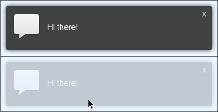

jNotifyOSD
=================

A jQuery-based notification plugin for creating notifications like Ubuntu's Notify OSD ones.

Screenshot:



Features
--------
* Can be easily plugged into [jQuery](http://jquery.com).
* Unobtrusive and minimalistic
  - Transparency on hover
  - Click _through_ notifications on links / buttons below them
* Simple API
* Theme-able and configurable
* Modifiable global defaults


Demo & Source Code
------------------
code: http://github.com/vickychijwani/jquery-notify-osd/ OR http://plugins.jquery.com/project/JNotifyOSD
demo: http://vickychijwani.github.com/jquery-notify-osd/


Usage
-----
Copy notify-osd.js and notify-osd.css to your project. The default theme can be changed by editing notify-osd.css. See examples below for how to use the plugin.


Supported Browsers
------------------
Tested on Firefox 4+, Chrome 1+. Should work just fine in Opera and Safari. IE support yet to be tested.

If you encounter any bugs, or have any suggestions, you can [file an issue](http://github.com/vickychijwani/jquery-notify-osd/issues).


Options
-------
The last two options should not usually be needed, but if your use-case calls for it, you have them available.

1. text (required, type: string)
   - The text to be displayed in the notification.

2. icon (type: string, path to image)
   - The optional icon to be displayed with the notification.

3. timeout (type: integer > 0, default: `5` seconds)
   - The number of seconds after which the notification should disappear automatically. **NOTE**: This option is _ignored_ if `sticky` is set to `true`.

4. sticky (type: boolean, default: `false`)
   - Whether the notification should disappear automatically after `timeout` seconds or not. **NOTE**: Sticky notifications are always `dismissable`.

5. dismissable (type: boolean, default: `false`)
   - If set to `true`, the notification can be dismissed manually. Ignored if `sticky` is `true`.

6. click_through (type: boolean, default: `false`)
   - If set to `true`, links and buttons below notifications can still be clicked on, i.e., the notification behaves as if it is not present there. **NOTE**: Doesn't work in IE and Opera.

7. buffer (type: integer, default: `40` pixels)
   - The width of the "buffer" region around a notification. As the mouse pointer goes deeper into the buffer region, the notification becomes more and more translucent, finally settling at the opacity given by `opacity_min`.

8. opacity_max and opacity_min (type: number in the range [0.0, 1.0], default: `0.85` and `0.20` respectively)
   - The maximum and minimum opacities of the notification. When the mouse pointer is far from the notification, its opacity is opacity_max, as the mouse comes closer the opacity goes to opacity_min. The region around the notification in which this occurrs is defined by the `buffer` option.


Examples
--------
```js
// simplest example, default settings
$.notify_osd.create({ text: 'Hey there!' });

// standard options
$.notify_osd.create({
  'text'        : 'Hi!',
  'icon'        : 'images/icon.png',     // icon path, 48x48
  'sticky'      : false,                 // if true, timeout is ignored
  'timeout'     : 6,                     // disappears after 6 seconds
  'dismissable' : true                   // can be dismissed manually
});

// default settings (apply to all future notifications)
$.notify_osd.setup({
  'icon'        : 'images/default.png',
  'sticky'      : false,
  'timeout'     : 8
});

// the following notification will have the default settings above ...
$.notify_osd.create({
  'text'        : 'Hello!'
});

// ... unless they are specifically overriden
$.notify_osd.create({
  'text'        : 'Hey!',
  'icon'        : 'images/override.png'
  'sticky'      : true
});

// dismiss all notifications (currently only one notification is allowed at a time)
$.notify_osd.dismiss();
```
